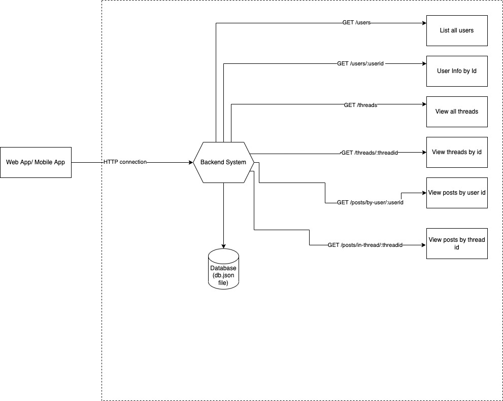
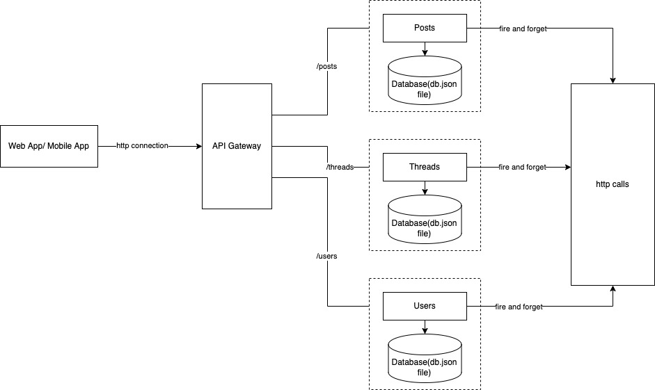

# demo-microservices-monolith

This app demonstrates how a nodejs monolith can be converted to microservices.

# Monolith App

## Monolith Architecture





## Running the monolith locally

Step 1: Clone this repository
Step 2: Navigate to the monolith folder
Steo 3: Run the following commands to start the application

``` 
    npm install
    npm start
```

Step 4: To test, run the following commands:
```
$ curl localhost:3000/api/users
$ curl localhost:3000/api/users/1
$ curl localhost:3000/api/threads
$ curl localhost:3000/api/threads/1
$ curl localhost:3000/api/posts/by-user/1
```

## Run the monolith on docker

Steo 1: Install and start docker
Steo 2: Build the docker image
```
   docker build . -t demo-app:1.0
```
Step 3: Run the docker image
```
   docker run -p 3000:3000 demo-app:1.0
```
Step 4: Test using the following commands:
```
$ curl localhost:3000/api/users
$ curl localhost:3000/api/users/1
$ curl localhost:3000/api/threads
$ curl localhost:3000/api/threads/1
$ curl localhost:3000/api/posts/by-user/1
```


## Run the monolith on RedHat OpenShift

Step 1: In this demo app, the [code ready containers](https://console.redhat.com/openshift/create/local) provided by OpenShift have been used. Install code ready containers for your desktop in case you dont have access to the OpenShift Container Platform.

Step 2: Login as the kubernetes admin. This role is temporary in crc. Therefore it is necessary to provide admin privileges to the developer.

```
oc login -u kubeadmin https://api.crc.testing:6443
oc adm policy add-role-to-user admin developer
```

Step 3: Login as developer and create the following namespaces

```
oc login -u developer https://api.crc.testing:6443
oc new-project demo-tools
oc new-project demo-dev
```

Step 4: Once logged in to the openshift namespace/crc namespace, execute the following commands:
Note: 'replace the route host in line 60 of monolith/openshift/deploy.yaml with the appropriate value'
Note: 'replace the namespace value in line 151 of monolith/openshift/deploy.yaml with the appropriate value'
Note: 'replace the route host in line 60 of monolith/openshift/deploy.yaml with the appropriate value'
Note: 'replace the GIT BRANCH and GIT URL values in line 99 and 102 of monolith/openshift/build.yaml with the appropriate value'


Note: If using the RedHat OpenShift Platform which enforces zero trust network, consider running the following network policy configuration (This needs to be run only once):

```
    oc -n <namespace> process -f operations/knp.yaml | oc -n <namespace> apply -f -

```

```
   # Import the Image 
   oc -n <tools-namespace> import-image ubi9/nodejs-16:1-36 --from=registry.access.redhat.com/ubi9/nodejs-16:1-36 --confirm

   # Build the Monolith App Image
   oc -n <tools-namespace> process -f monolith/openshift/build.yaml | oc -n <tools-namespace> apply -f -

   # Tag the Image in the Dev Namespace
   oc tag <tools-namespace>/demo-monolith:1.0 <dev-namespace>/demo-monolith:1.0

   # Deploy the Image in the Dev Namespace
   oc -n <dev-namespace> process -f monolith/openshift/deploy.yaml| oc -n <dev-namespace> apply -f -

```

Step 5: Test using the following commands:

```
  curl http://<route-host>/api/users/
  curl http://<route-host>/api/users/1
  curl http://<route-host>/api/threads
  curl http://<route-host>/api/threads/1
  curl http://<route-host>/api/posts/by-user/1
```

# Microservices App

## Microservices Architecture




## Running the microservices locally

Step 1: Clone this repository
Step 2: Navigate to the microservices folder
Steo 3: Run the following commands to start each microservice

``` 
    cd posts
    npm install
    PORT=3001 npm start
```

``` 
    cd threads
    npm install
    PORT=3002 npm start
```

``` 
    cd users
    npm install
    PORT=3003 npm start
```

Step 4: To test, run the following commands:
```
$ curl localhost:3003/api/users
$ curl localhost:3003/api/users/1
$ curl localhost:3002/api/threads
$ curl localhost:3002/api/threads/1
$ curl localhost:3001/api/posts/by-user/1
```

## Running the microservices on docker

Step 1: Clone this repository
Step 2: Navigate to the microservices folder
Steo 3: Run the following commands to start each microservice

``` 
    cd posts
    docker build . -t post:1.0
    docker run -p 
```

``` 
    cd threads
    npm install
    PORT=3002 npm start
```

``` 
    cd users
    npm install
    PORT=3003 npm start
```

Step 4: To test, run the following commands:
```
$ curl localhost:3003/api/users
$ curl localhost:3003/api/users/1
$ curl localhost:3002/api/threads
$ curl localhost:3002/api/threads/1
$ curl localhost:3001/api/posts/by-user/1

```

## Running the microservices on OpenShift

There are OpenShift namespaces set up for this project and Github Workflows established for CI/CD.
Since there are 3 microservices, an API gateway config is required for routing requests. The BC Gov API Gateway service is used in this scenario, however, the kong gateway doesnt support path based routing therefore and Apache Reverse Proxy server has been setup to redirect requests.

### Apache Reverse Proxy Config

The Apache Reverse Proxy Config is currently being deployed only to the prod namespace and is not part of CI/CD pipeline since it is a one time build and deployment.

Step 1: 
```
oc -n <prod-namespace> import-image rhscl/httpd-24-rhel7:2.4-200 --from=registry.access.redhat.com/rhscl/httpd-24-rhel7:2.4-200 --confirm
```
Step 2:
```
cd microservices/apache-reverse-proxy/openshift
oc -n <prod-namespace>  process -f build.yaml| oc -n <prod-namespace> apply -f -
oc -n <prod-namespace> process -f build.yaml| oc -n <prod-namespace> apply -f -
```

## CI-CD

A sample Github actions workflow is provided as part of this repo under .github folder which can be used as reference for CI/CD, however github actions is currently not configured for this repository and pull requests will not trigger a CI or CD flow. The referenced files are in adherance to the Git flow and not the most optimized method to build and deploy on OpenShift. Methods that encorporate Single command line build and deployment will be incorporated in future versions of this repository.

Git flow is the most commonly used pattern; therefore, it makes sense to have 3 GitHub workflows:
Workflow 1 – CI : It is recommended to tie a release branch to a big user story or epic and individual feature branches for each developer working on the release. All the feature branches are merged to the release branch triggering the CI workflow which deploys changes only to the DEV namespace
Workflow 2 – CI/CD : This workflow runs only when Pull Requests are created to the main branch from the release branch and involve deploying the accumulated changes to dev, test and prod.
Workflow 3 – Clean : It is highly recommended to have a clean workflow to ensure that residual resources in the build and dev namespaces (and test) are cleaned up to optimize resource usage. This workflow is triggered when PRs are merged, closed or deleted.

### What do I need to set up GitHub Actions for OpenShift?

- A service account in OpenShift (this is needed because login tokens for regular users expire in 12 to 24 hrs)
```

   # create a new service account for github actions
   oc -n <tools-namespace> create sa cicd
   # provide admin access to all the namespaces so that this service account can access and create resources within each namespace
   oc -n <tools-namespace> policy add-role-to-user admin -z cicd 
   oc -n <dev-namespace> policy add-role-to-user admin system:serviceaccount:<tools-namespace>:cicd
   oc -n <test-namespace> policy add-role-to-user admin system:serviceaccount:<tools-namespace>:cicd
   oc -n <prod-namespace> policy add-role-to-user admin system:serviceaccount:<tools-namespace>:cicd
   
```

- Secrets for actions within Github settings, one for the openshift url and the other for the service account token (generated by openshift). 

- Environments in github settings for setting reviewers before deployment to dev, test and prod environments.

### API Gateway Configurations

In order to access the BC Gov API gateway service, the documentation provided was followed and an instance was created in the test environment. The microservices/gateway-config/sample.yaml  has the relevant configurations and the application is accessible at:

```

https://demo-microservices-test-api-gov-bc-ca.test.api.gov.bc.ca/posts

https://demo-microservices-test-api-gov-bc-ca.test.api.gov.bc.ca/threads

https://demo-microservices-test-api-gov-bc-ca.test.api.gov.bc.ca/users

```

###  Overview on Github Actions Workflows

- There are five workflows configured, one each for the monolith and the 3 microservices and one for a clean up. These workflows are currently triggered when a pull request is created to the main branch. In case if the pull request is updated, concurrrent runs of the workflows will be cancelled automatically
- The CI-CD workflows are based on continuous delivery principles and would build the image once and deploy it in dev, test and prod namespaces on openshift. The deployment to dev happens automatically. However, deployments to test and prod happen based on a review process. 
- The workflows are also configured to automatically comment the URLs/routes for testing in each environment which make the review process easier since the reviewer on GitHub doesnt need to go to the OpenShift console to check the routes.
- Once the PR is merged or closed, the clean workflow runs which cleans up the tools, dev and test namespace on OpenShift to optimize resource utilization.
- All deployments are done using . Pipeline-cli is an npm based tool that is used to abstract openshift commands to make it easier to build and deploy on openshift using a single command line which is platform independent meaning, the same command can be used to build and deploy irrespective of which tool you use for CI/CD.


### Next Steps

- Ideally, each github workflow should run only when changes are made to the specific folder. Github actions currently doesnt provide a direct method to do this, so work is in progress to implement this functionality.

Let us know if you need to see any new features through a pull request.

## FAQs

### 1. How do we put our code into an OpenShift pod?

Step 1: Build code locally

Step 2: Ensure code works within a container

Step 2.a: Based on your code and language, choose image from docker registry

Step 2.b: Pull Image from registry

Step 2.c: Copy code to Image

Step 2.d: Change container command if you need to 

Step 2.e: Create new Image

Step 2.f: Run image as container and check if your code runs

Step 3: Choose an OpenShift Image from the Red Hat Registry

Step 3.a: First look for an s2i image

Step 3.b: Write a Build template and a deployment template (yaml or json because that’s what OpenShift understands)

Step 3.c: Use the OpenShift Console or command line to build the container image and then run (deploy) it on OpenShift

###  2. Why is the OpenShift Image Registry Preferred?

It offers better security and enterprise grade images as well as an option known as source-to-image conversion where you don’t need to write a dockerfile 

### 3. What does a build template contain?

- Source Image to be used from docker or RedHat registry

- Destination Image metadata

- Build Config : How is the Destination image built from the source image, does it get the code from GitHub (s2i), is the image modified(dockerfile), is the code obtained from a local machine? How much resources are needed for the build?

### 4. What if an s2i image doesn’t do its job for us?

You will need to then modify an s2i image or a docker image using a dockerfile and use that docker image to build your code

### 5. What does a deployment template contain?

- Image to be deployed

- Deployment Config: Environmental Variables, startup commands if any, storage volumes if any, number of replicas for availability, rules for deployment (rolling or recreate), health checks, CPU and memory utilization in terms of request and limits

- Service: A Kubernetes service serves as an internal load balancer. It identifies a set of replicated pods in order to proxy the connections it receives to them. Services are assigned an IP address and port pair that, when accessed, proxy to an appropriate backing pod. A service uses a label selector to find all the containers running that provide a certain network service on a certain port.

- Routes: An OpenShift Container Platform route exposes a service at a host name, such as www.example.com, so that external clients can reach it by name.

#### References 

- https://github.com/jrdalino/aws-ecs-monolith-to-microservices-workshop
- https://developers.redhat.com/download-manager/file/ContainerColoringBook.pdf

 