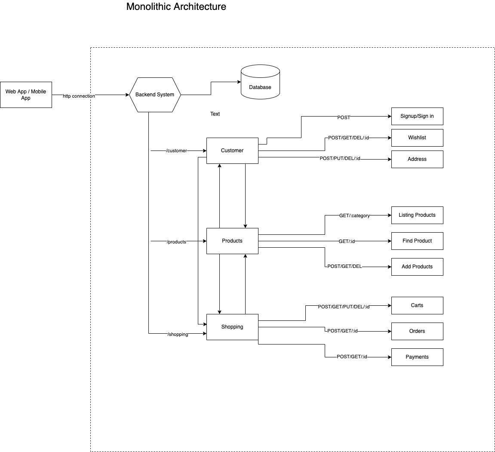
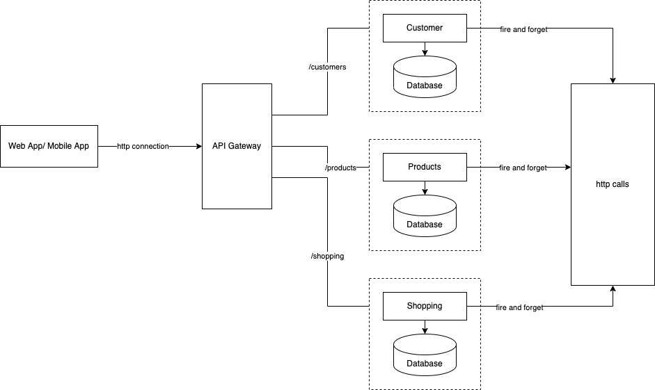

# demo-microservices-openshift
This repository demonstrates a monolithic app as well as its microservices counterpart deployed on openshift

## Online Household Products Application

### Functional Requirements
1. Listing Available Products
2. User Signup/Sign in
3. Adding Products to Cart
4. Adding Products to Wishlist
5. Placing an Order
6. Viewing Orders

### Monolithic Architecture Diagram

### Microservices Architecture Diagram
